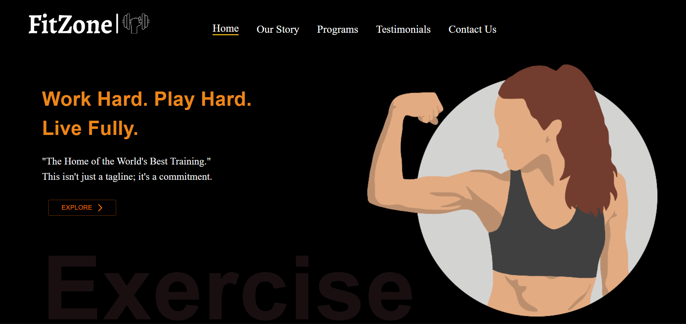
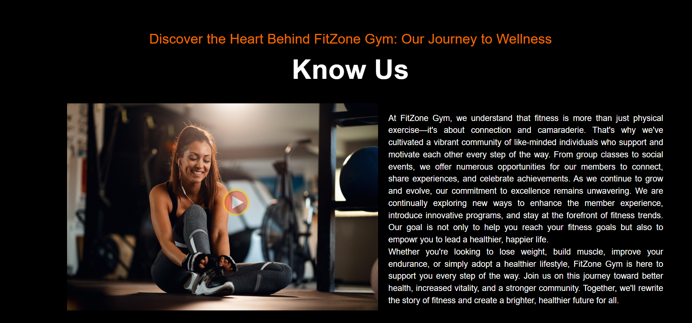
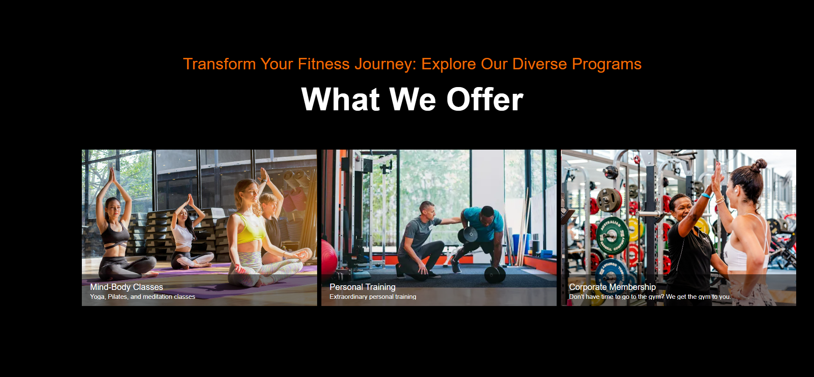
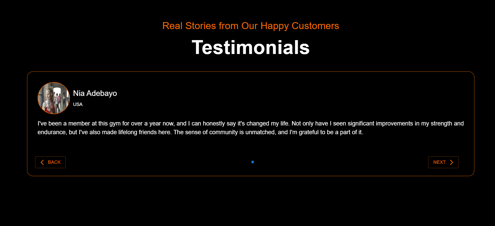
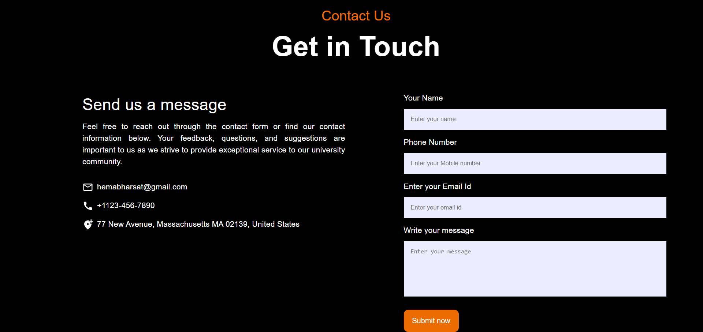

# FitZone

FitZone is a comprehensive fitness website designed to cater to all your health and wellness needs. Whether you're looking to start your fitness journey, maintain a healthy lifestyle, or take your workouts to the next level, FitZone has something for everyone., developed using React and CSS.

## Demo

https://fit-zone-gym.vercel.app/







## Installation

1. Clone the repository:

   ```bash
   git clone https://github.com/HemaBharsat/FitZone
   ```

2. Install dependencies

   ```bash
   npm install
   ```

3. Run the project

   ```bash
   npm start
   ```

## Made By

- [@HemaBharsat](https://github.com/HemaBharsat)
